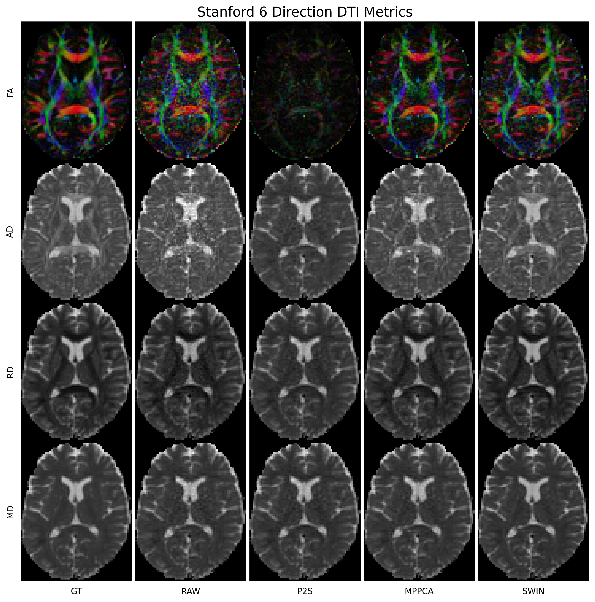
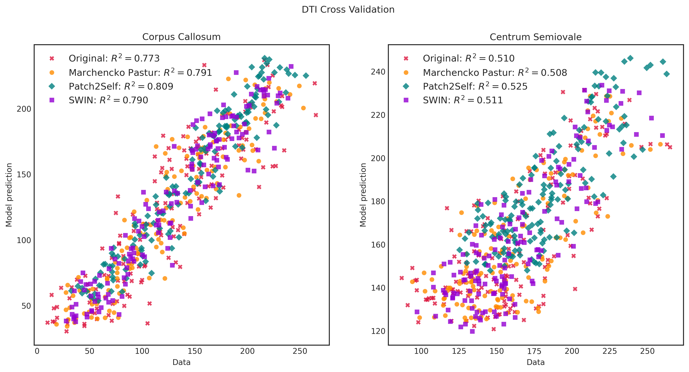
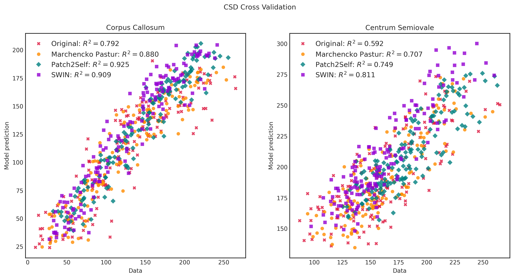

# Diffusion MRI SWIN UNETR

In this repository, we present using SWIN transformers to do generalized diffusion MRI denoising and super-resolution. Our model is robust to:
- wide array of scanners (ge, siemens, etc.)
- different acquisition parameters (TE, TR, b-value, b-vector, etc.)
- diverse patient populations (adult patients with mTBI, children with neurodevelopmental disorders, children/adolescents with lesions, etc.)

The performance benefits of our model out-of-the-box over other methods will vary from dataset to dataset and we have seen improvements from finetuning even on a single scan from one patient. We have also done further analysis and have found that our model is more repeatable than other SOTA denoising methods.

Please cite:
Generalized Diffusion MRI Denoising and Super-Resolution using Swin Transformers

Amir Sadikov*, Jamie Wren-Jarvis, Xinlei Pan, Lanya T. Cai, Pratik Mukherjee

Paper: https://arxiv.org/abs/2303.05686


## Quickstart
1. Clone the repo
2. Run pip install -r dmri-swin/requirements.txt or install the required packages
3. Download the model at https://drive.google.com/file/d/143yqY4VgaMhuDVspRVsP1dw6PkPpDH8z/view?usp=sharing and move it to dmri-swin/models
4. For inference look at the swin_denoise function in inference.py or optionally use inference_cli.py which contains a cli utility
5. Make sure that your data is sufficiently preprocessed. We used freesurfer's SynthStrip for brain masking, but any good masking algorithm will do. We require fsl's Eddy to be performed on the diffusion MRI (preferentially with topup if possible) and for poor quality T1 images it's best to use freesurfer's recon-all or recon-all-clinical and take the T1.mgz or synthSR.mgz respectively. Good quality T1 images can be used as is. Next, we align the diffusion MRI and T1 volumes using Boundary-based Registration with the freesurfer bbregister or the fsl epi_reg command use the white matter mask supplied by freesurfer recon-all/recon-all-clinical or use the WM regions given by freesurfer mri_synthseg.
6. As a summary, you need diffusion MRI data (4D Volume) and its brain mask (3D Volume) as well as an aligned T1 scan (3D volume).
7. As an example: ```python dmri-swin/inference_cli.py --dwi=/data/dwi.nii.gz --bvals=/data/dwi.bval --mask=/data/mask.nii.gz --t1=/data/t1.nii.gz --output=output.nii.gz --resample=True --resample_back=True --low_mem=True```

where:
- `--dwi` path to a diffusion MRI nifti file.
- `--bvals` path to a plain file which contains b-values.
- `--mask` path to a mask nifti file. Must be in the same space as the dwi.
- `--t1` path to a T1 MRI nifti file. Must be aligned to the dwi file.
- `--output` (optional) default is swin_denoised.nii.gz. This is the path to where you want to save the Swin denoising dwi data.
- `--config` (optional) default is dmri-swin/models/swin_denoise.yaml. This is the path to where the model config file is. You shouldn't need to change this.
- `--resample` (optional) default is True. Set to false only if data is at 1.25 mm isotropic resolution or very close +/- 0.1 mm.
- `--resample_back` (optional) default is True. If True, this resamples the Swin model output from 1.25 mm isotropic to whatever the input dwi resolution was. If False, this does not resample and outputs data at 1.25 mm isotropic resolution.
- `--low_mem` (optional) default is False. Pushes each 3D dwi volume into memory sequentially (to save gpu memory) instead of all at once. Useful for large dwi scan sizes.

### Example
We use the Stanford HARDI dataset provided by dipy to illustrate the use of our out-of-the-box model in validation.py (takes 6-direction subset and finds mean absolute error in white matter and gray matter as well as plots diffusion tensor parametric maps) and validation_p2s.py (does Patch2Self-style cross-validation using the full acquisition). In each case, we compare our model to MPPCA and Patch2Self.



